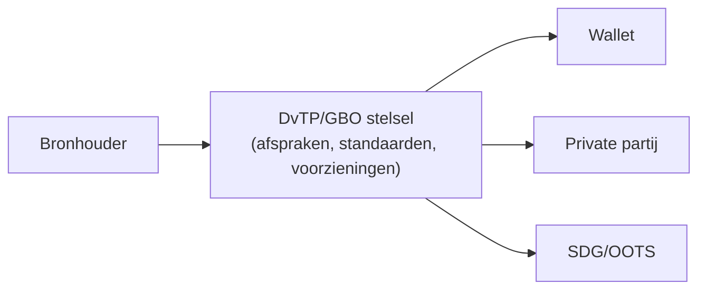
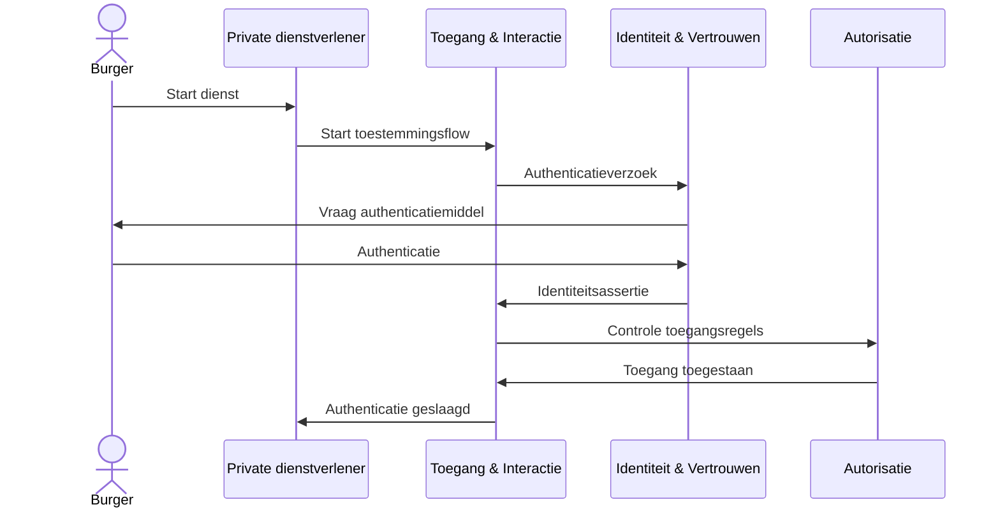
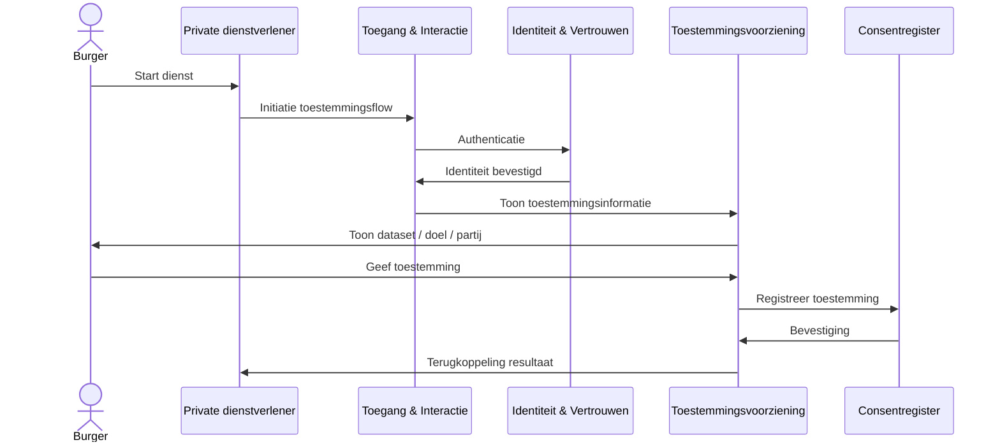
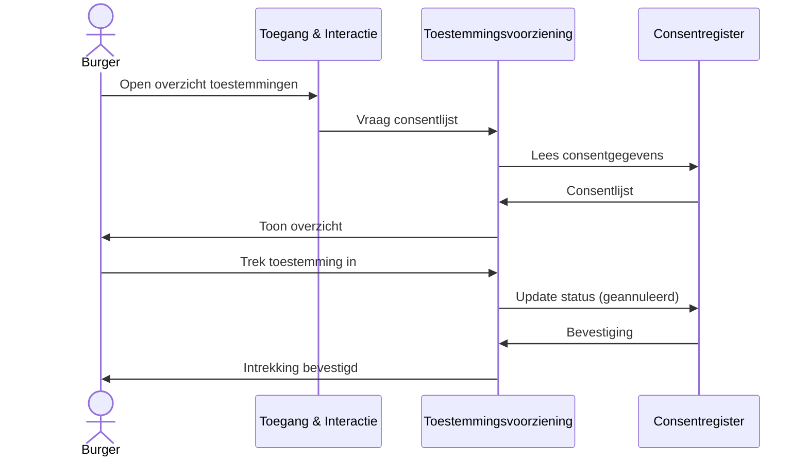
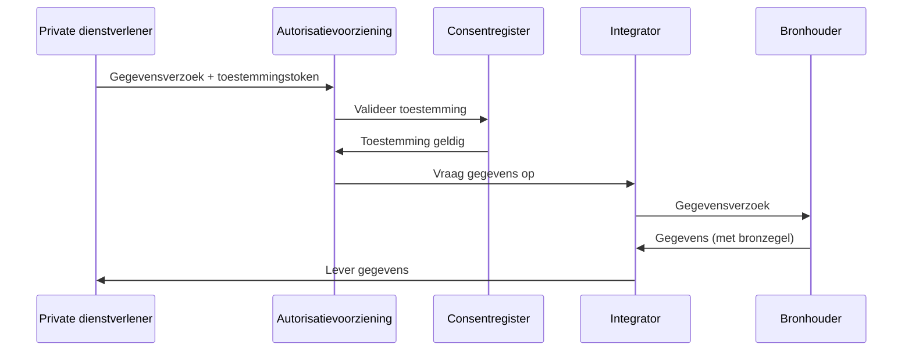
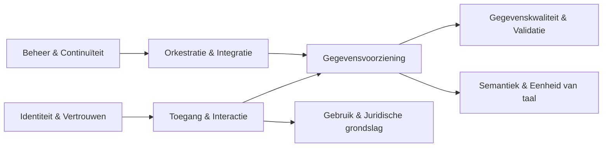
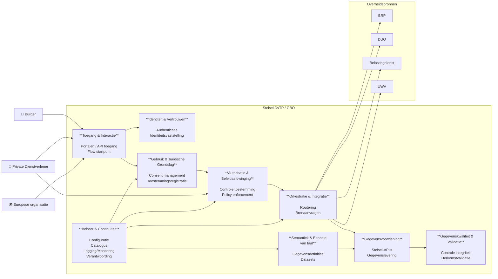

# Inleiding

## Doel van dit document

Dit document beschrijft de Project Start Architectuur (PSA) voor het
programma **DvTP/GBO**.

De PSA beschrijft: - de doelstelling van de oplossing - de context
waarin de oplossing opereert - de architectuurprincipes en kaders - de
benodigde generieke functies en capabilities - de beoogde logische
architectuur

De PSA beschrijft **wat de oplossing moet kunnen**, maar legt nog geen
technische implementatie vast.

## Scope

De PSA beschrijft de architectuur voor een generieke infrastructuur
waarmee:

-   burgers gegevens van overheidsorganisaties kunnen verkrijgen
-   burgers deze gegevens kunnen delen met private partijen
-   gegevens gebruikt kunnen worden voor Europese toepassingen zoals
    **EDI Wallet** en **SDG/OOTS**

De PSA omvat: - het afsprakenstelsel - generieke functies -
capabilities - architectuurkaders

De PSA beschrijft nog niet: - concrete technische oplossingen -
implementaties van componenten - leverancierskeuzes

------------------------------------------------------------------------

## Relatie met andere architecturen

De PSA sluit aan bij:

-   NORA
-   GDI
-   EDI Wallet / EUDI Wallet
-   Single Digital Gateway (SDG)
-   Once Only Technical System (OOTS)
-   Federatief Datastelsel
-   ...

# Context en aanleiding

## Beleidscontext

Beschrijving van:

- regie op gegevens
- Europese ontwikkelingen
- digitale overheid
- rol van wallets

------------------------------------------------------------------------

## Huidige situatie

- Onnodige administratieve lasten voor burgers en organisaties doordat dezelfde gegevens herhaaldelijk worden opgevraagd en aangeleverd.

- Risicovolle werkpraktijken (documentuitwisseling, datadeler-apps, scraping) die niet passen bij een gecontroleerde, transparante en uniforme keten.

- Beperkte innovatie en dienstverlening doordat hergebruik van geverifieerde brongegevens richting private diensten niet goed mogelijk is, terwijl de maatschappelijke behoefte hieraan groeit.

(zie probleemomschrijving in Beleidskompas)

------------------------------------------------------------------------

## Probleemstelling

- Geheimhoudingsplichten en strikte doelbinding in sectorale wetten

- Ontbreken van een expliciete bevoegdheid om aan private dienstverleners te verstrekken op verzoek van de burger

- Toestemming van de burger is in de overheid-context vaak geen stevige grondslag

- Versnippering van regels en verantwoordelijkheden over sectoren en organisaties

- Omwegen in de praktijk door frictie tussen behoefte en wat juridisch/operationeel kan

- Scraping en vergelijkbare vormen van geautomatiseerd verzamelen vergroten risico’s en zijn juridisch kwetsbaar

Welke problemen lost DvTP/GBO op?

------------------------------------------------------------------------

## Doelstelling

- burgers toestemming geven en beheren via een vertrouwde overheidsomgeving, op basis van begrijpelijke informatie over doel, gegevens en ontvanger;

- private dienstverleners alleen gegevens opvragen binnen de afgesproken reikwijdte en de burger terugkoppelen welke gegevens zijn ontvangen en gebruikt;

- bronhouders alleen verstrekken na verificatie van een geldig verzoek en binnen een afgebakend doel, met waarborgen voor integriteit en herleidbaarheid.

# Ecosysteem en rollen

## Actoren

Uitwerking van rollen:

-   Burger
-   Bronhouder
-   Afnemer (publiek/privaat)
-   Wallet
-   DvTP/GBO stelsel
-   Governance organisatie

------------------------------------------------------------------------

## Contextdiagram

In de contextdiagram worden de actoren ten opzichte van elkaar en van het DvTP/GBO stelsel geschetst.

<figure>

<figcaption>Contextdiagram</figcaption>
</figure>

# Use cases

Use cases helpen bepalen welke capabilities nodig zijn.

## Use case: Zorgeloos vastgoed

Beschrijving van het scenario.

------------------------------------------------------------------------

## Use case: LVG

Beschrijving van het scenario.

------------------------------------------------------------------------

## Use case: Vullen van de EDI Wallet

Beschrijving.

------------------------------------------------------------------------

## Use case: Gebruik in SDG/OOTS

Beschrijving.

# Interactiepatronen DvTP (PSA)

Dit document beschrijft de belangrijkste interactiepatronen voor DvTP zoals afgeleid uit de functionele requirements. De patronen zijn bedoeld voor gebruik in de PSA en zijn daarom **logisch (technologie‑onafhankelijk)** beschreven.

------------------------------------------------------------------------

## Identificatie en authenticatie van een actor

### Doel

Het vaststellen van de identiteit van een actor (bijv. burger of organisatie) voordat toegang wordt verleend tot functies van het stelsel.

### Betrokken generieke functies

-   Identiteit & Vertrouwen
-   Toegang & Interactie
-   Autorisatie & Beleidsafdwinging

### Actoren

-   Burger
-   Private dienstverlener
-   Identiteitsdienst
-   DvTP/GBO‑stelsel

### Interactie

<figure>

<figcaption>Interactiepatroon identificatie en authenticatie actor</figcaption>
</figure>

------------------------------------------------------------------------

## Toestemming geven en registreren

### Doel

Een burger geeft expliciete toestemming voor het delen van een specifieke dataset met een specifieke private dienstverlener.

### Betrokken generieke functies

-   Toegang & Interactie
-   Identiteit & Vertrouwen
-   Gebruik & Juridische grondslag
-   Gegevensvoorziening

### Actoren

-   Burger
-   Private dienstverlener
-   Toestemmingsvoorziening
-   Consentregister

### Interactie

<figure>

<figcaption>Interactiepatroon toestemming geven</figcaption>
</figure>

------------------------------------------------------------------------

## Toestemming beheren of intrekken

### Doel

De burger kan een eerder gegeven toestemming bekijken en intrekken.

### Betrokken generieke functies

-   Toegang & Interactie
-   Gebruik & Juridische grondslag
-   Logging & Verantwoording

### Actoren

-   Burger
-   Toestemmingsvoorziening
-   Consentregister

### Interactie

<figure>

<figcaption>Interactiepatroon toestemming intrekken</figcaption>
</figure>

------------------------------------------------------------------------

## Gegevensverzoek van afnemer naar bronhouder

### Doel

Een private dienstverlener haalt gegevens op bij een bronhouder op basis van een geldige toestemming van de burger.

### Betrokken generieke functies

-   Autorisatie & Beleidsafdwinging
-   Gegevensvoorziening
-   Orkestratie & Integratie
-   Logging & Verantwoording

### Actoren

-   Private dienstverlener
-   Integrator (optioneel)
-   Autorisatievoorziening
-   Consentregister
-   Bronhouder

### Interactie

<figure>

<figcaption>Interactiepatroon gegevensverzoek</figcaption>
</figure>

# Architectuurprincipes

## Gegevensprincipes

Bijvoorbeeld: - gegevens blijven bij de bron - dataminimalisatie -
eenmalige ontsluiting

------------------------------------------------------------------------

## Privacy en juridische principes

Bijvoorbeeld: - toestemming expliciet - transparantie voor burgers -
auditbaarheid

------------------------------------------------------------------------

## Technische principes

Bijvoorbeeld: - open standaarden - API-first - federatief waar mogelijk

------------------------------------------------------------------------

## Governanceprincipes

Bijvoorbeeld: - duidelijke rolverdeling - certificering van deelnemers

# Generieke functies (logische architectuur)

Capabilities worden gerealiseerd door **generieke functies**.

## Overzicht generieke functies

Uit de interactiepatronen en het capability model blijken de volgende generieke functies nodig.

1. Identiteit & Vertrouwen
2. Toegang & Interactie
3. Gegevensvoorziening
4. Semantiek & Eenheid van taal
5. Gegevenskwaliteit & Validatie
6. Gebruik & Juridische Grondslag
7. Orkestratie & Integratie
8. Beheer & Continuïteit

(hier mist "Logging & Verantwoording" dat vaak in architecturen specifieke aandacht krijgt. Hier lijkt dat impliciet in "Beheer & Continuïteit" te zitten, maar moet misschien expliciet gemaakt worden)

------------------------------------------------------------------------

## Logisch architectuurdiagram

Het logische architectuurdiagram schetst de generieke functies ten opzichte van elkaar.

<figure>

<figcaption>Logisch architectuurdiagram</figcaption>
</figure>

# Capabilities

Dit hoofdstuk beschrijft **wat het stelsel moet kunnen**.

## Capability model

De generieke functies uit het logisch architectuurmodel worden mogelik gemaakt met zogenaamde capabilities.
In de onderstaande diagram zijn de benodigde capabilities per generieke functie geschetst.

<figure>

<figcaption>Generieke functies met capabilities</figcaption>
</figure>

In de volgende paragrafen worden deze toegelicht.

## Identiteit & Vertrouwen

Doel: betrouwbaar vaststellen wie een partij is en of deze vertrouwd kan worden.

Capabilities:

Identificatie van burgers

Identificatie van organisaties

Authenticatie van gebruikers

Authenticatie van systemen

Federatieve identiteiten

Vertrouwensketens

Beheer van identiteitsattributen

Verificatie van identiteit

## Toegang & Interactie

Doel: faciliteren van interactie tussen burgers, afnemers en bronhouders.

Capabilities:

Initiëren van gegevensverzoeken

Toegang verlenen tot gegevens

Autorisatiecontrole

Toestemming registreren

Toestemming controleren

Toestemming intrekken

Verzoekroutering

API-interactie

Sessiebeheer

Foutafhandeling

## Gegevensvoorziening

Doel: beschikbaar stellen van gegevens vanuit bronhouders.

Capabilities:

Registreren van gegevensbronnen

Beschrijven van datasets

Gegevensverzoeken ontvangen

Gegevens ophalen bij bronhouders

Gegevens leveren aan afnemers

Gegevens leveren aan wallets

Gegevensminimalisatie

Gegevensformattering

Versiebeheer van gegevens

## Semantiek & Eenheid van taal

Doel: zorgen dat gegevens overal dezelfde betekenis hebben.

Capabilities:

Beheer van informatiemodellen

Beheer van begrippen en definities

Mapping tussen datamodellen

Standaardisatie van gegevensstructuren

Semantische validatie

Metadata beheer

## Gegevenskwaliteit & Validatie

Doel: waarborgen dat gegevens betrouwbaar en bruikbaar zijn.

Capabilities:

Validatie van gegevens

Controle op volledigheid

Controle op actualiteit

Controle op consistentie

Foutdetectie

Rapportage over datakwaliteit

## Gebruik & Juridische Grondslag

Doel: waarborgen dat gegevens rechtmatig gebruikt worden.

Capabilities:

Vaststellen juridische grondslag

Beheer van gebruiksvoorwaarden

Controle op doelbinding

Privacybescherming

Verantwoording van gegevensgebruik

Audit van gegevensgebruik

Logging van gebruik

## Orkestratie & Integratie

Doel: coördineren van gegevensuitwisseling tussen partijen.

Capabilities:

Coördineren van gegevensstromen

Service discovery

Integratie met externe systemen

Protocolvertaling

Workflowcoördinatie

Eventafhandeling

Berichtenafhandeling

## Beheer & Continuïteit

Doel: stabiele en betrouwbare werking van het stelsel.

Capabilities:

Logging en monitoring van dienstverlening

Incidentbeheer

Capaciteitsbeheer

Configuratiebeheer

Continuïteitsbeheer

Versiebeheer van interfaces

Rapportage / verantwoording over gebruik

# Architectuurkaders

Kaders voor de technische uitwerking:

- Europese Kaders  
- Nederlandse Digitale Strategie  
- Federatief Datastelsel  
- MIDO / GDI  
- ...  

# Realisatiestrategie

Beschrijving van:

- pilot  
- gefaseerde implementatie  
- validatie via use cases  
- stelselfuncties bij bestaande gremia  

# Openstaande vraagstukken

Bijvoorbeeld: - centrale vs federatieve consentregistratie - rol van
wallets - governance model
