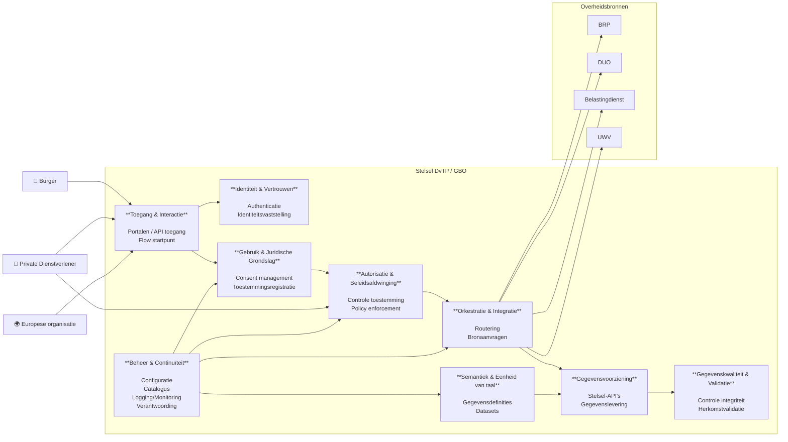

# 8. Capabilities

Dit hoofdstuk beschrijft **wat het stelsel moet kunnen**.

## 8.1. Capability model

De generieke functies uit het logisch architectuurmodel worden mogelik gemaakt met zogenaamde capabilities.
In de onderstaande diagram zijn de benodigde capabilities per generieke functie geschetst.

In de volgende paragrafen worden deze toegelicht.

## 8.1. Identiteit & Vertrouwen

Doel: betrouwbaar vaststellen wie een partij is en of deze vertrouwd kan worden.

Capabilities:

Identificatie van burgers

Identificatie van organisaties

Authenticatie van gebruikers

Authenticatie van systemen

Federatieve identiteiten

Vertrouwensketens

Beheer van identiteitsattributen

Verificatie van identiteit

## 8.2. Toegang & Interactie

Doel: faciliteren van interactie tussen burgers, afnemers en bronhouders.

Capabilities:

Initiëren van gegevensverzoeken

Toegang verlenen tot gegevens

Autorisatiecontrole

Toestemming registreren

Toestemming controleren

Toestemming intrekken

Verzoekroutering

API-interactie

Sessiebeheer

Foutafhandeling

## 8.3. Gegevensvoorziening

Doel: beschikbaar stellen van gegevens vanuit bronhouders.

Capabilities:

Registreren van gegevensbronnen

Beschrijven van datasets

Gegevensverzoeken ontvangen

Gegevens ophalen bij bronhouders

Gegevens leveren aan afnemers

Gegevens leveren aan wallets

Gegevensminimalisatie

Gegevensformattering

Versiebeheer van gegevens

## 8.4. Semantiek & Eenheid van taal

Doel: zorgen dat gegevens overal dezelfde betekenis hebben.

Capabilities:

Beheer van informatiemodellen

Beheer van begrippen en definities

Mapping tussen datamodellen

Standaardisatie van gegevensstructuren

Semantische validatie

Metadata beheer

## 8.5. Gegevenskwaliteit & Validatie

Doel: waarborgen dat gegevens betrouwbaar en bruikbaar zijn.

Capabilities:

Validatie van gegevens

Controle op volledigheid

Controle op actualiteit

Controle op consistentie

Foutdetectie

Rapportage over datakwaliteit

## 8.6. Gebruik & Juridische Grondslag

Doel: waarborgen dat gegevens rechtmatig gebruikt worden.

Capabilities:

Vaststellen juridische grondslag

Beheer van gebruiksvoorwaarden

Controle op doelbinding

Privacybescherming

Verantwoording van gegevensgebruik

Audit van gegevensgebruik

Logging van gebruik

## 8.7. Orkestratie & Integratie

Doel: coördineren van gegevensuitwisseling tussen partijen.

Capabilities:

Coördineren van gegevensstromen

Service discovery

Integratie met externe systemen

Protocolvertaling

Workflowcoördinatie

Eventafhandeling

Berichtenafhandeling

## 8.9. Beheer & Continuïteit

Doel: stabiele en betrouwbare werking van het stelsel.

Capabilities:

Logging en monitoring van dienstverlening

Incidentbeheer

Capaciteitsbeheer

Configuratiebeheer

Continuïteitsbeheer

Versiebeheer van interfaces

Rapportage / verantwoording over gebruik
