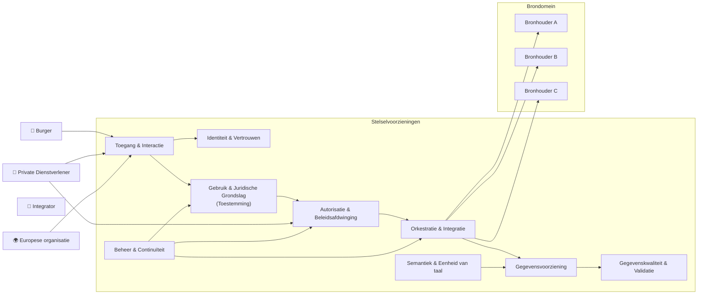
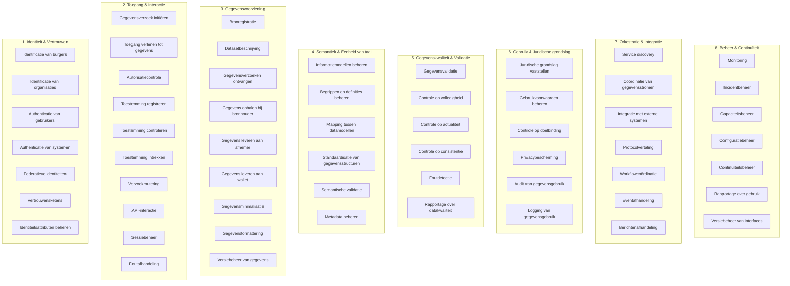

# 7. Capability model

Dit hoofdstuk beschrijft **wat het stelsel moet kunnen**.

## 7.1 Overzicht capability domeinen

In de onderstaande diagram is geschetst welke generieke functies het stelsel moet ondersteunen - de "capability domeinen".

------------------------------------------------------------------------

## 7.2 Capability map

De capability map beschrijft de functionele vermogens die nodig zijn om het delen van gegevens via toestemming mogelijk te maken.

De capabilities zijn gegroepeerd volgens de acht generieke functies die eerder in het programma zijn vastgesteld.

De capability map vormt de basis voor:

- de verdere architectuuruitwerking,

- de identificatie van benodigde generieke voorzieningen,

- en de latere software-architectuur.

