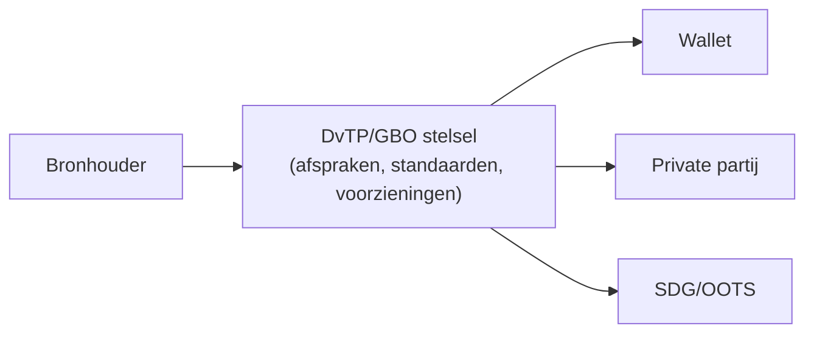

# Ecosysteem en rollen

## Actoren

Uitwerking van rollen:

-   Burger
-   Bronhouder
-   Afnemer (publiek/privaat)
-   Wallet
-   DvTP/GBO stelsel
-   Governance organisatie

------------------------------------------------------------------------

## Contextdiagram

In de contextdiagram worden de actoren ten opzichte van elkaar en van het DvTP/GBO stelsel geschetst.

