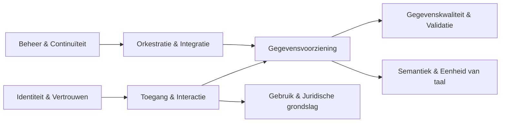

# Generieke functies (logische architectuur)

Capabilities worden gerealiseerd door **generieke functies**.

## Overzicht generieke functies

Uit de interactiepatronen en het capability model blijken de volgende generieke functies nodig.

1. Identiteit & Vertrouwen
2. Toegang & Interactie
3. Gegevensvoorziening
4. Semantiek & Eenheid van taal
5. Gegevenskwaliteit & Validatie
6. Gebruik & Juridische Grondslag
7. Orkestratie & Integratie
8. Beheer & Continuïteit

(hier mist "Logging & Verantwoording" dat vaak in architecturen specifieke aandacht krijgt. Hier lijkt dat impliciet in "Beheer & Continuïteit" te zitten, maar moet misschien expliciet gemaakt worden)

------------------------------------------------------------------------

## Logisch architectuurdiagram

Het logische architectuurdiagram schetst de generieke functies ten opzichte van elkaar.

